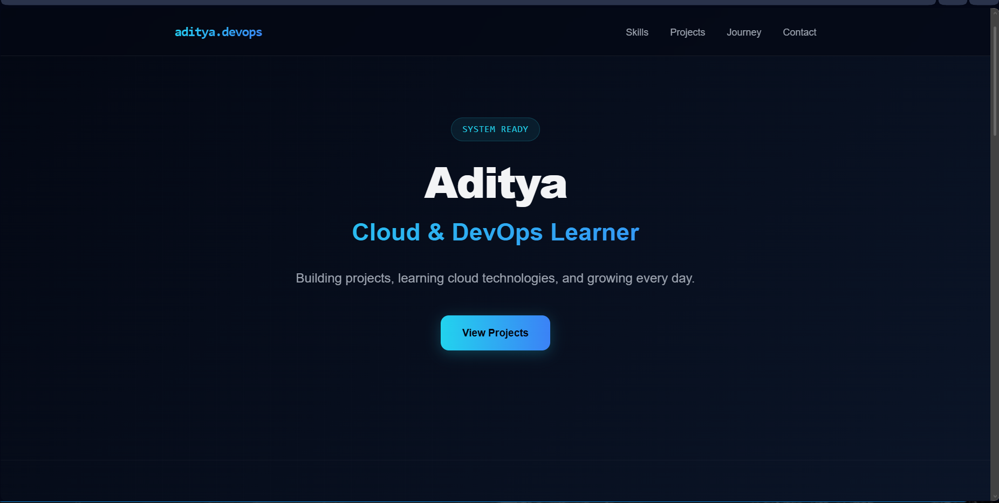
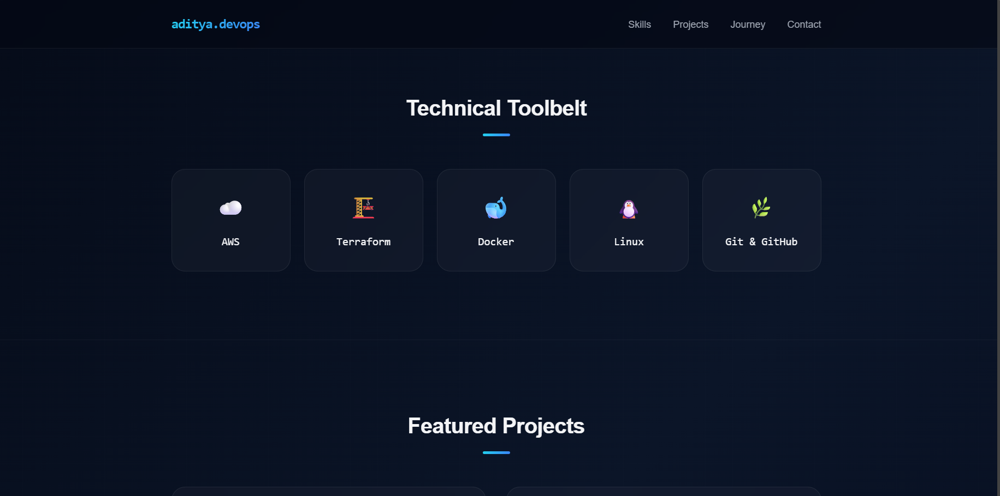
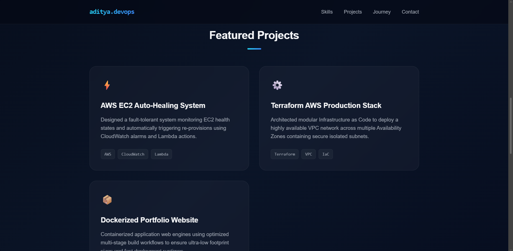
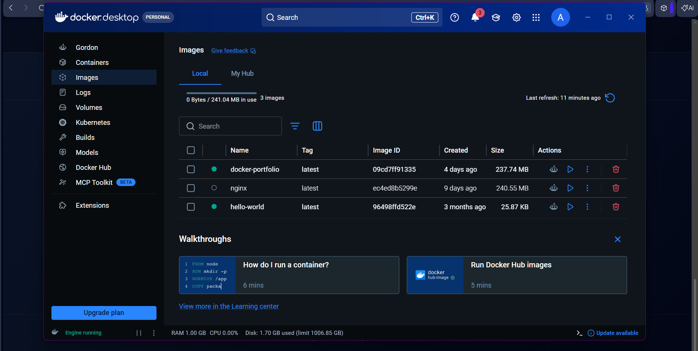
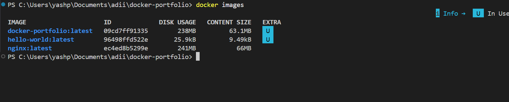

# 🐳 Docker Portfolio Website



A simple static portfolio website containerized using Docker and served with Nginx.

---

## 🚀 Features

- Static Portfolio Website
- Dockerized using Dockerfile
- Served with Nginx
- Port Mapping using Docker
- Responsive UI

---

## 🛠️ Technologies Used

- Docker
- Nginx
- HTML5
- CSS3

---

## 📚 What I Learned

- Docker Images
- Docker Containers
- Dockerfile
- Nginx Base Image
- Docker Build Process
- Port Mapping
- Running Containers

---

## ▶️ Docker Commands

### Build Image

```bash
docker build -t docker-portfolio .
```

### Run Container

```bash
docker run -d -p 8080:80 --name myportfolio docker-portfolio
```

### Open Website

```
http://localhost:8080
```

---


## 📸 Screenshots

### Website Preview


### Features Section



### Technologies Section



### Docker Desktop



### Docker Terminal



---

## 👨‍💻 Author

**Aditya**
